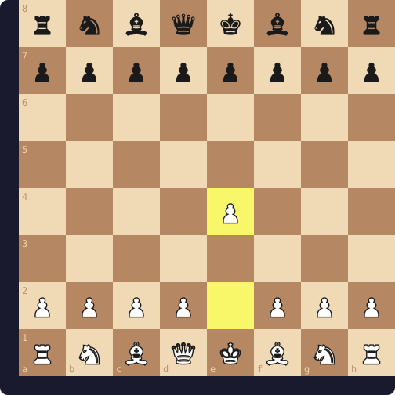

<div align="center">


<a href="https://git.io/typing-svg">
  
</a>

<p>
  
  <a href="https://github.com/roycrisses?tab=followers">
    
  </a>
  
</p>

<p align="center">
  <a href="mailto:contact@krishnakarki.info.np">
    
  </a>
  <a href="https://github.com/roycrisses" target="_blank">
    
  </a>
  <a href="https://www.linkedin.com/in/krishna-karki-a1b566323/" target="_blank">
    
  </a>
  <a href="https://krishnakarki.info.np/" target="_blank">
    
  </a>
</p>

</div>

---

<div align="center">
  <a href="https://roycrisses.github.io/roycrisses/">
    
  </a>
  <p><b>👆 Click the PC to boot KarkiOS, a tiny Linux-style desktop where you can explore my profile, projects and even browse the web.</b></p>
</div>

---

<!-- CHESS-START -->
## ♟️ Community Chess — play me right here

<div align="center">

**Game #1 · ⚪ White to move — Visitors**

Last move: — (new game) · Moves played: 0



*Click a move below to play it (opens a pre-filled Issue → bot validates legality + turn, board refreshes in ~30s). You must be logged into GitHub to move.*

[a3](https://github.com/roycrisses/roycrisses/issues/new?title=chess%7Ca2a3%7Cb1791d7f%7Cg1&body=Move%3A%20a2a3%0AGame%3A%201%0A%0AThis%20issue%20was%20created%20from%20the%20profile%20README%20chess%20board.%0AThe%20bot%20validates%20legality%20%2B%20turn%20order%20and%20updates%20the%20board%20automatically.%0APlease%20don't%20edit%20the%20title%20%E2%80%94%20it%20encodes%20the%20move.) · [a4](https://github.com/roycrisses/roycrisses/issues/new?title=chess%7Ca2a4%7Cb1791d7f%7Cg1&body=Move%3A%20a2a4%0AGame%3A%201%0A%0AThis%20issue%20was%20created%20from%20the%20profile%20README%20chess%20board.%0AThe%20bot%20validates%20legality%20%2B%20turn%20order%20and%20updates%20the%20board%20automatically.%0APlease%20don't%20edit%20the%20title%20%E2%80%94%20it%20encodes%20the%20move.) · [b3](https://github.com/roycrisses/roycrisses/issues/new?title=chess%7Cb2b3%7Cb1791d7f%7Cg1&body=Move%3A%20b2b3%0AGame%3A%201%0A%0AThis%20issue%20was%20created%20from%20the%20profile%20README%20chess%20board.%0AThe%20bot%20validates%20legality%20%2B%20turn%20order%20and%20updates%20the%20board%20automatically.%0APlease%20don't%20edit%20the%20title%20%E2%80%94%20it%20encodes%20the%20move.) · [b4](https://github.com/roycrisses/roycrisses/issues/new?title=chess%7Cb2b4%7Cb1791d7f%7Cg1&body=Move%3A%20b2b4%0AGame%3A%201%0A%0AThis%20issue%20was%20created%20from%20the%20profile%20README%20chess%20board.%0AThe%20bot%20validates%20legality%20%2B%20turn%20order%20and%20updates%20the%20board%20automatically.%0APlease%20don't%20edit%20the%20title%20%E2%80%94%20it%20encodes%20the%20move.) · [c3](https://github.com/roycrisses/roycrisses/issues/new?title=chess%7Cc2c3%7Cb1791d7f%7Cg1&body=Move%3A%20c2c3%0AGame%3A%201%0A%0AThis%20issue%20was%20created%20from%20the%20profile%20README%20chess%20board.%0AThe%20bot%20validates%20legality%20%2B%20turn%20order%20and%20updates%20the%20board%20automatically.%0APlease%20don't%20edit%20the%20title%20%E2%80%94%20it%20encodes%20the%20move.) · [c4](https://github.com/roycrisses/roycrisses/issues/new?title=chess%7Cc2c4%7Cb1791d7f%7Cg1&body=Move%3A%20c2c4%0AGame%3A%201%0A%0AThis%20issue%20was%20created%20from%20the%20profile%20README%20chess%20board.%0AThe%20bot%20validates%20legality%20%2B%20turn%20order%20and%20updates%20the%20board%20automatically.%0APlease%20don't%20edit%20the%20title%20%E2%80%94%20it%20encodes%20the%20move.) · [d3](https://github.com/roycrisses/roycrisses/issues/new?title=chess%7Cd2d3%7Cb1791d7f%7Cg1&body=Move%3A%20d2d3%0AGame%3A%201%0A%0AThis%20issue%20was%20created%20from%20the%20profile%20README%20chess%20board.%0AThe%20bot%20validates%20legality%20%2B%20turn%20order%20and%20updates%20the%20board%20automatically.%0APlease%20don't%20edit%20the%20title%20%E2%80%94%20it%20encodes%20the%20move.) · [d4](https://github.com/roycrisses/roycrisses/issues/new?title=chess%7Cd2d4%7Cb1791d7f%7Cg1&body=Move%3A%20d2d4%0AGame%3A%201%0A%0AThis%20issue%20was%20created%20from%20the%20profile%20README%20chess%20board.%0AThe%20bot%20validates%20legality%20%2B%20turn%20order%20and%20updates%20the%20board%20automatically.%0APlease%20don't%20edit%20the%20title%20%E2%80%94%20it%20encodes%20the%20move.) · [e3](https://github.com/roycrisses/roycrisses/issues/new?title=chess%7Ce2e3%7Cb1791d7f%7Cg1&body=Move%3A%20e2e3%0AGame%3A%201%0A%0AThis%20issue%20was%20created%20from%20the%20profile%20README%20chess%20board.%0AThe%20bot%20validates%20legality%20%2B%20turn%20order%20and%20updates%20the%20board%20automatically.%0APlease%20don't%20edit%20the%20title%20%E2%80%94%20it%20encodes%20the%20move.) · [e4](https://github.com/roycrisses/roycrisses/issues/new?title=chess%7Ce2e4%7Cb1791d7f%7Cg1&body=Move%3A%20e2e4%0AGame%3A%201%0A%0AThis%20issue%20was%20created%20from%20the%20profile%20README%20chess%20board.%0AThe%20bot%20validates%20legality%20%2B%20turn%20order%20and%20updates%20the%20board%20automatically.%0APlease%20don't%20edit%20the%20title%20%E2%80%94%20it%20encodes%20the%20move.) · [f3](https://github.com/roycrisses/roycrisses/issues/new?title=chess%7Cf2f3%7Cb1791d7f%7Cg1&body=Move%3A%20f2f3%0AGame%3A%201%0A%0AThis%20issue%20was%20created%20from%20the%20profile%20README%20chess%20board.%0AThe%20bot%20validates%20legality%20%2B%20turn%20order%20and%20updates%20the%20board%20automatically.%0APlease%20don't%20edit%20the%20title%20%E2%80%94%20it%20encodes%20the%20move.) · [f4](https://github.com/roycrisses/roycrisses/issues/new?title=chess%7Cf2f4%7Cb1791d7f%7Cg1&body=Move%3A%20f2f4%0AGame%3A%201%0A%0AThis%20issue%20was%20created%20from%20the%20profile%20README%20chess%20board.%0AThe%20bot%20validates%20legality%20%2B%20turn%20order%20and%20updates%20the%20board%20automatically.%0APlease%20don't%20edit%20the%20title%20%E2%80%94%20it%20encodes%20the%20move.) · [g3](https://github.com/roycrisses/roycrisses/issues/new?title=chess%7Cg2g3%7Cb1791d7f%7Cg1&body=Move%3A%20g2g3%0AGame%3A%201%0A%0AThis%20issue%20was%20created%20from%20the%20profile%20README%20chess%20board.%0AThe%20bot%20validates%20legality%20%2B%20turn%20order%20and%20updates%20the%20board%20automatically.%0APlease%20don't%20edit%20the%20title%20%E2%80%94%20it%20encodes%20the%20move.) · [g4](https://github.com/roycrisses/roycrisses/issues/new?title=chess%7Cg2g4%7Cb1791d7f%7Cg1&body=Move%3A%20g2g4%0AGame%3A%201%0A%0AThis%20issue%20was%20created%20from%20the%20profile%20README%20chess%20board.%0AThe%20bot%20validates%20legality%20%2B%20turn%20order%20and%20updates%20the%20board%20automatically.%0APlease%20don't%20edit%20the%20title%20%E2%80%94%20it%20encodes%20the%20move.) · [h3](https://github.com/roycrisses/roycrisses/issues/new?title=chess%7Ch2h3%7Cb1791d7f%7Cg1&body=Move%3A%20h2h3%0AGame%3A%201%0A%0AThis%20issue%20was%20created%20from%20the%20profile%20README%20chess%20board.%0AThe%20bot%20validates%20legality%20%2B%20turn%20order%20and%20updates%20the%20board%20automatically.%0APlease%20don't%20edit%20the%20title%20%E2%80%94%20it%20encodes%20the%20move.) · [h4](https://github.com/roycrisses/roycrisses/issues/new?title=chess%7Ch2h4%7Cb1791d7f%7Cg1&body=Move%3A%20h2h4%0AGame%3A%201%0A%0AThis%20issue%20was%20created%20from%20the%20profile%20README%20chess%20board.%0AThe%20bot%20validates%20legality%20%2B%20turn%20order%20and%20updates%20the%20board%20automatically.%0APlease%20don't%20edit%20the%20title%20%E2%80%94%20it%20encodes%20the%20move.) · [Na3](https://github.com/roycrisses/roycrisses/issues/new?title=chess%7Cb1a3%7Cb1791d7f%7Cg1&body=Move%3A%20b1a3%0AGame%3A%201%0A%0AThis%20issue%20was%20created%20from%20the%20profile%20README%20chess%20board.%0AThe%20bot%20validates%20legality%20%2B%20turn%20order%20and%20updates%20the%20board%20automatically.%0APlease%20don't%20edit%20the%20title%20%E2%80%94%20it%20encodes%20the%20move.) · [Nc3](https://github.com/roycrisses/roycrisses/issues/new?title=chess%7Cb1c3%7Cb1791d7f%7Cg1&body=Move%3A%20b1c3%0AGame%3A%201%0A%0AThis%20issue%20was%20created%20from%20the%20profile%20README%20chess%20board.%0AThe%20bot%20validates%20legality%20%2B%20turn%20order%20and%20updates%20the%20board%20automatically.%0APlease%20don't%20edit%20the%20title%20%E2%80%94%20it%20encodes%20the%20move.) · [Nf3](https://github.com/roycrisses/roycrisses/issues/new?title=chess%7Cg1f3%7Cb1791d7f%7Cg1&body=Move%3A%20g1f3%0AGame%3A%201%0A%0AThis%20issue%20was%20created%20from%20the%20profile%20README%20chess%20board.%0AThe%20bot%20validates%20legality%20%2B%20turn%20order%20and%20updates%20the%20board%20automatically.%0APlease%20don't%20edit%20the%20title%20%E2%80%94%20it%20encodes%20the%20move.) · [Nh3](https://github.com/roycrisses/roycrisses/issues/new?title=chess%7Cg1h3%7Cb1791d7f%7Cg1&body=Move%3A%20g1h3%0AGame%3A%201%0A%0AThis%20issue%20was%20created%20from%20the%20profile%20README%20chess%20board.%0AThe%20bot%20validates%20legality%20%2B%20turn%20order%20and%20updates%20the%20board%20automatically.%0APlease%20don't%20edit%20the%20title%20%E2%80%94%20it%20encodes%20the%20move.)

</div>

<details>
<summary>📜 PGN + rules (click to expand)</summary>

- **Visitors = White, Krishna = Black.** White moves first. Visitors move only on White's turn, Krishna only on Black's turn.
- Only **legal chess moves** are accepted (castling, en passant, promotion, check rules enforced by `chess.js`).
- Promotion defaults to queen — underpromotion links appear automatically when available (e.g. `e7e8=n`).
- First valid move wins; stale/duplicate/issues with edited titles are rejected with a comment.
- Checkmate / stalemate / draw auto-archives the PGN to `games/` and starts the next game.

Recent PGN: `—`

[Move history](https://github.com/roycrisses/roycrisses/issues?q=label%3Achess-move+is%3Aissue) · [All games](./games/)

</details>

<!-- CHESS-END -->

---

## 👋 About Me

<table>
<tr>
<td width="55%">

```js
const krishna = {
  pronouns: "he/him",
  base: "Butwal, Nepal 🇳🇵",
  education: "B.IT @ Far Western University",
  role: "Course Design & Digital Initiatives @ SAKDU",
  founder: "Solo founder — AI-driven SaaS & tools",
  philosophy: "Vibe Coding — intent-driven development",
  funFact: "Every bug is an undocumented feature! 🐛"
};
```

</td>
<td width="45%">

- 🎓 **AI Educator** — designing AI curricula at **SAK Digital University**
- 🛠️ **Builder** — shipping **GitPulse**, **ClipPro**, and **NOVAI**
- 💻 **Dev** — security + AI tooling in the open: **Vulnerability-Finder**, **AI-Cyber-security**
- 🧠 Exploring **MoE pruning** and **multi-agent orchestration**
- 💬 Ask me about **React, Next.js, Supabase, AI agents**
- ⚡ Motto: *"Learn something new daily!"*

</td>
</tr>
</table>

---

## 🚀 Tech Stack

<div align="center">

### Core


### Languages


### AI / Infra


</div>

---

## 📊 GitHub Stats

<div align="center">
  
  
</div>

<div align="center">
  
</div>

---

## 💎 Featured Projects

*Pulled live from [github.com/roycrisses](https://github.com/roycrisses) — original repos only, forks excluded.*

| Project | Description | Stack |
|:---|:---|:---|
| **[Vulnerability-Finder](https://github.com/roycrisses/Vulnerability-Finder)** | Autonomous security engine bridging heuristic scanning with LLM-driven reasoning — orchestrates industry-standard tools and Claude (via Bonsai Proxy) to understand business logic, not just open ports |   |
| **[AI-Cyber-security](https://github.com/roycrisses/AI-Cyber-security)** | Production-grade middleware that detects, classifies, and defends against prompt-injection attacks on LLM apps — multi-layer detection, real-time scoring, sanitization, observability dashboard |   |
| **[DEV-mind](https://github.com/roycrisses/DEV-mind)** | Open-source prompt library that makes any AI model think like a senior engineer |   |
| **[codebasee-chat-](https://github.com/roycrisses/codebasee-chat-)** | CLI tool to chat with any codebase instantly — `pip install codebase-chat`, run it, start asking questions |   |
| **[CRDTs](https://github.com/roycrisses/CRDTs)** | Collaborative canvas/whiteboard built on Conflict-free Replicated Data Types — distributed systems + browser performance |   |
| **[venuev-ui-portfolio](https://github.com/roycrisses/venuev-ui-portfolio)** | Client UI/portfolio build |  |
| **[marketing-ants](https://github.com/roycrisses/marketing-ants)** | Marketing-focused build |  |
| **[gangamarketingagency](https://github.com/roycrisses/gangamarketingagency)** | Agency client site |  |

<div align="center">
  <a href="https://github.com/roycrisses/Vulnerability-Finder">
    
  </a>
  <a href="https://github.com/roycrisses/AI-Cyber-security">
    
  </a>
</div>

---

## 🎓 Certifications

<div align="center">


</div>

---

## 🤝 Let's Connect!

<div align="center">
  <p><i>AI educator, builder, and dev — always open to collaborating on AI tooling, dev platforms, and education-tech projects.</i></p>

  <a href="https://github.com/roycrisses">
    
  </a>
  <a href="https://www.linkedin.com/in/krishna-karki-a1b566323/">
    
  </a>
  <a href="mailto:contact@krishnakarki.info.np">
    
  </a>
</div>

<br/>

<div align="center">
  
</div>

<div align="center">
  <br/>
  
  <br/>
  <i>⭐ Thanks for visiting! Have a wonderful day! ⭐</i>
</div>
